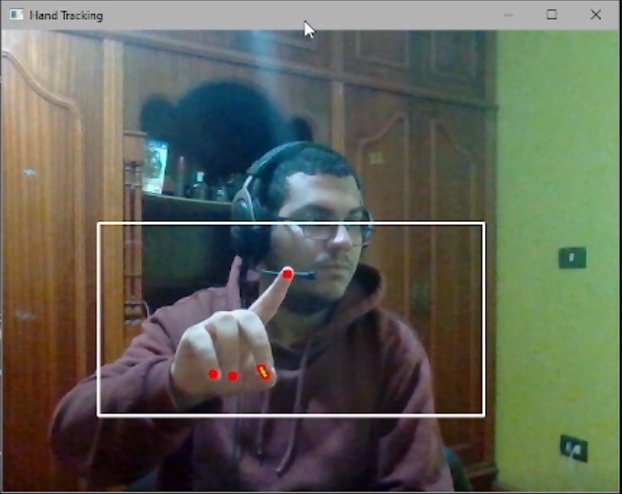

# Virtual Mouse

### How to use
Index finger is used to move the mouse, middle finger and thumb pressing each other is a mouse click
you can double click by pressing your thumb and middle finger together rapidly twice.

As seen here, when a successful mouse click occurs, the line between the thumb and middle finger
turns green
