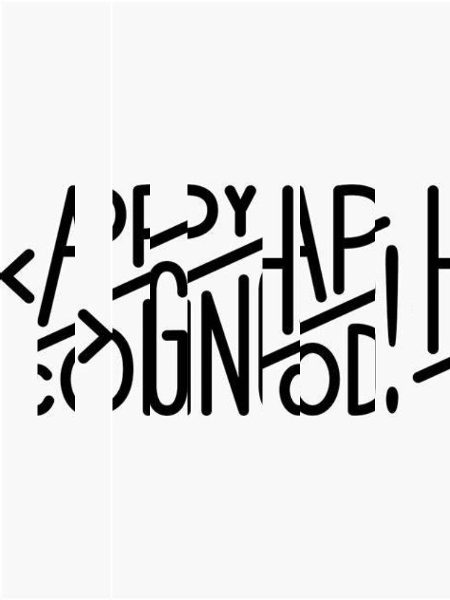

# Unshredder

### How to use
Given a width of the image, set in the code the "shred_width" variable to the width/number shreds.
Then give the image path to the function, to which it will return the correct sequence as an array, and display the correct sequence

For example this shredded image gets converted into this.

